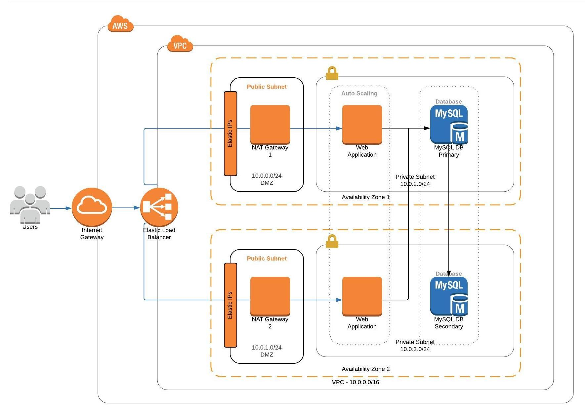

# Deploy a High-availability Web App - AWS CloudFormation
---
"ND9991 - C2- Infrastructure as Code - Deploy a high-availability web app using CloudFormation" project - Cloud DevOps Engineering Courese 2.

This directory contains the following files:

### final-project-starter.yml
Write CloudFormation code using this YAML template for building the cloud infrastructure, based on specification and/or requirements.

### server-parameters.json
A JSON file for increasing the generic nature of the YAML code. For example, the JSON file contains a "ParameterKey" as "EnvironmentName" and "ParameterValue" as "UdacityProject". 

In YAML code, the `${EnvironmentName}` would be substituted with `UdacityProject` accordingly.

### Bash scripts
```create-stack.sh``` ```delete-stack.sh``` ```update-stack.sh```
> These are (reusable) helper scripts that can be used to create, delete, and update CloudFormation stacks.

---
Infrastructure Diagram:


---
##### Load Balancer DNS:
The web application can be accessed via a [load balancer URL](http://udagr-WebAp-GQ3Z3HPIUIWT-818124837.us-east-2.elb.amazonaws.com) domain name.